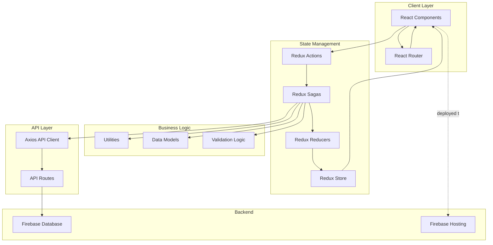
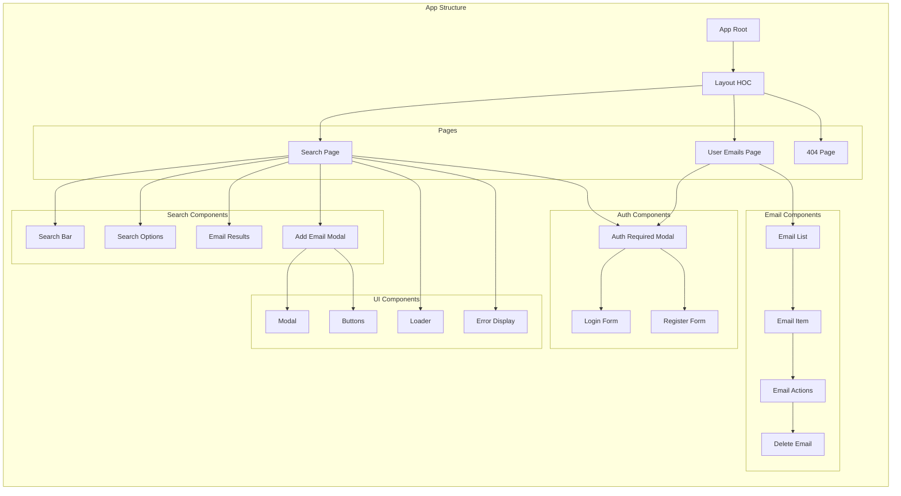
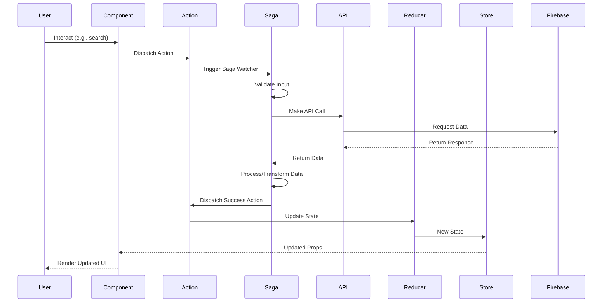

# Email Searcher

A React-based web application that demonstrates how to display email crawler results from a server to the user interface. Built in 2018, this client application showcases modern web development practices with React, Redux, and Firebase integration.

## Features

- 🔍 **Email Search**: Search for email addresses using multiple criteria
- 🎯 **Advanced Filtering**: Filter results by domains, URLs, and custom keys
- 📊 **Search Modes**: Multiple search modes for different use cases
- 👤 **User Authentication**: Secure user registration and login system
- 💾 **Email Management**: Save and manage found emails in personal collections
- 📱 **Responsive Design**: Works seamlessly across desktop and mobile devices
- 🔄 **Real-time Updates**: Redux-Saga powered state management for smooth UX
- 🌐 **Firebase Integration**: Hosted on Firebase with real-time database support

## Architecture



## Component Architecture



## State Management Flow



## Getting Started

### Prerequisites

- Node.js (v10 or higher)
- npm (v6 or higher)
- Firebase account (for deployment)

### Installation

1. Clone the repository:
```bash
git clone https://github.com/orassayag/email-searcher.git
cd email-searcher
```

2. Navigate to the application directory:
```bash
cd email-searcher
```

3. Install dependencies:
```bash
npm install
```

4. Configure Firebase:
- Update settings in `src/settings/application/settings.development.js`
- Configure your Firebase project details

### Running the Application

#### Development Mode
```bash
npm start
```
Opens the app at [http://localhost:3000](http://localhost:3000) with hot reloading.

#### Production Build
```bash
npm run build
```
Creates an optimized production build in the `build/` folder.

#### Testing
```bash
npm test
```
Launches the test runner in interactive watch mode.

## Project Structure

```
email-searcher/
├── config/                 # Build and webpack configurations
├── public/                 # Static files
│   ├── index.html
│   ├── manifest.json
│   └── icons/
├── scripts/                # Build scripts
├── src/
│   ├── api/               # API client and routes
│   │   ├── api.js         # Axios instance
│   │   └── routes/        # API route definitions
│   ├── components/        # React components
│   │   ├── Email/         # Email display components
│   │   ├── Navigation/    # Navigation components
│   │   ├── Search/        # Search functionality
│   │   ├── UI/            # Reusable UI components
│   │   ├── UserAuthentication/ # Auth components
│   │   └── UserEmails/    # Email management
│   ├── containers/        # Container components
│   ├── enums/             # Constants and enumerations
│   ├── hoc/               # Higher-order components
│   ├── models/            # Data models and PropTypes
│   │   ├── models/        # Class models
│   │   ├── conversion/    # Data converters
│   │   ├── proptypes/     # PropType definitions
│   │   └── helpers/       # Helper classes
│   ├── routes/            # Application routes
│   ├── settings/          # Application configuration
│   │   ├── application/   # Environment settings
│   │   └── logic/         # Business logic settings
│   ├── store/             # Redux store
│   │   ├── actions/       # Redux actions
│   │   ├── reducers/      # Redux reducers
│   │   └── sagas/         # Redux-Saga logic
│   ├── translate/         # Internationalization
│   ├── utils/             # Utility functions
│   └── index.js           # Application entry point
├── firebase.json          # Firebase configuration
├── package.json
└── README.md
```

## Technology Stack

- **Frontend Framework**: React 16.5+
- **State Management**: Redux + Redux-Saga
- **Routing**: React Router 4
- **HTTP Client**: Axios
- **Styling**: Less
- **Build Tool**: Webpack (via Create React App)
- **Backend/Hosting**: Firebase
- **Testing**: Jest + Enzyme
- **Linting**: ESLint

## Key Features Explained

### Search System

The search system allows users to:
- Enter search keywords
- Apply multiple filters (domains, URLs, keys)
- Choose between different search modes
- View paginated results
- Add emails to personal collection

### User Authentication

Secure authentication system with:
- User registration with validation
- Login functionality
- Session management
- Protected routes
- Authentication-required modals

### Email Management

Users can:
- View all saved emails
- Delete emails from collection
- Track email metadata
- See email count statistics

### State Management

Built with Redux and Redux-Saga:
- **Actions**: Type-safe action creators
- **Reducers**: Pure state update functions
- **Sagas**: Handle side effects and async operations
- **Store**: Centralized application state

## Development

### Code Style

The project follows:
- ESLint configuration for React
- Component-based architecture
- Redux best practices
- Saga patterns for side effects

### Building

```bash
npm run build
```

Creates an optimized production build with:
- Minified JavaScript
- Optimized CSS
- Hashed filenames for caching
- Source maps for debugging

### Linting

```bash
npm run lint
```

## Deployment

### Firebase Hosting

1. Install Firebase CLI:
```bash
npm install -g firebase-tools
```

2. Login to Firebase:
```bash
firebase login
```

3. Build and deploy:
```bash
npm run build
firebase deploy
```

## Browser Support

- Chrome (latest)
- Firefox (latest)
- Safari (latest)
- Edge (latest)

Legacy browser support:
- Not Internet Explorer 11
- Not Opera Mini

## Contributing

Contributions to this project are [released](https://help.github.com/articles/github-terms-of-service/#6-contributions-under-repository-license) to the public under the [project's open source license](LICENSE).

Everyone is welcome to contribute. Contributing doesn't just mean submitting pull requests—there are many different ways to get involved, including answering questions and reporting issues.

Please see [CONTRIBUTING.md](CONTRIBUTING.md) for detailed contribution guidelines.

## Documentation

- [INSTRUCTIONS.md](INSTRUCTIONS.md) - Detailed setup and usage instructions
- [CONTRIBUTING.md](CONTRIBUTING.md) - Contribution guidelines

## Author

* **Or Assayag** - *Initial work* - [orassayag](https://github.com/orassayag)
* Or Assayag <orassayag@gmail.com>
* GitHub: https://github.com/orassayag
* StackOverflow: https://stackoverflow.com/users/4442606/or-assayag?tab=profile
* LinkedIn: https://linkedin.com/in/orassayag

## License

This application is licensed under the MIT License - see the [LICENSE](LICENSE) file for details.

## Acknowledgments

- Built with [Create React App](https://github.com/facebook/create-react-app)
- Hosted on [Firebase](https://firebase.google.com/)
- State management with [Redux](https://redux.js.org/) and [Redux-Saga](https://redux-saga.js.org/)
